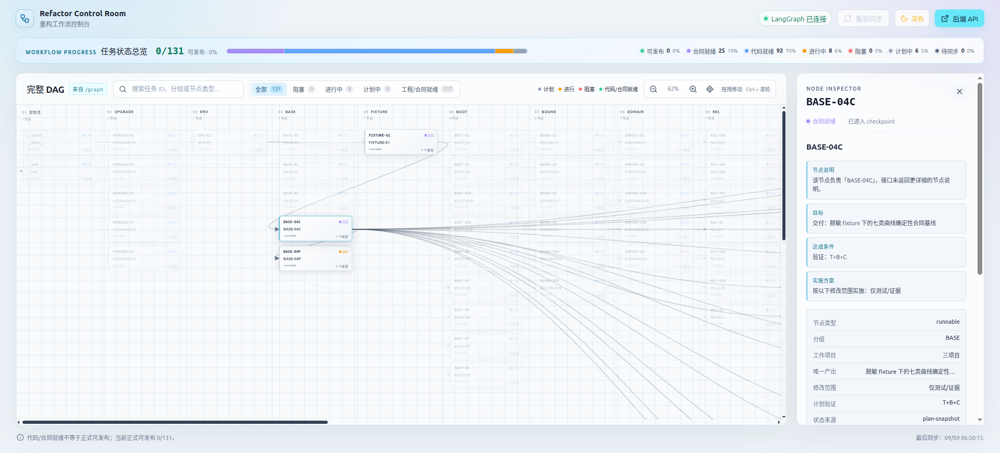

# Refactor Control Room

独立的 React + Vite + LangGraph 重构 DAG 控制台。LangGraph 服务已经随项目放在
`backend/` 下，前端通过本地代理访问它：

- POST /assistants/search 动态发现 refactor_dag
- GET /assistants/{assistant_id}/graph 动态读取节点和依赖边
- POST /threads/{thread_id}/runs/wait 同步节点运行状态
- 开发环境通过 Vite /langgraph 代理访问项目内的 http://127.0.0.1:8123
- 开发/预览环境通过 Vite /api/agents/launch 在本机打开 Konsole，并在 APP18/APP19/APP20 白名单仓库启动 Agent CLI

当前项目内置 131 个业务节点；LangGraph API 会额外返回 `__start__`、`__end__`
两个控制节点。页面会根据接口响应实时计算数量。



上图展示了完整 DAG、状态筛选、画布聚焦和右侧节点详情面板。节点与状态数量均来自 LangGraph API，不依赖前端硬编码的任务列表。

## 功能概览

- 动态读取 `refactor_dag` 的 graph definition，展示节点、分组、依赖边和控制节点。
- 执行一次 LangGraph run，同步任务状态、checkpoint 进入情况、状态来源和 evidence 信息。
- 支持按任务 ID、分组、节点类型搜索，并组合状态筛选。
- 状态筛选按钮支持循环聚焦：点击“阻塞”“进行中”“计划中”或“工程/合同就绪”后，画布会聚焦该结果中的一个节点；再次点击同一按钮切换下一个结果，点击到末尾后从头循环。搜索条件也会参与结果计算。“全部”仅切换为全量视图，不执行节点循环聚焦。
- 选中节点后自动将节点移动到画布视口中央，并弱化无关节点和连线；右侧面板展示目标、达成条件、实施方案、依赖和后续节点。
- 支持画布拖拽、缩放按钮以及 `Ctrl + 鼠标滚轮` 缩放，提供深色/浅色主题切换。
- 从节点详情面板启动 OpenCode、Pi 或 Codex，在 APP18/APP19/APP20 白名单工作目录打开新的 Konsole 窗口，并自动注入节点上下文。

## 启动

环境要求：Node.js 20.19+、npm，以及 Python 3.10+。首次启动会自动在
`backend/.venv` 创建 Python 虚拟环境并安装 LangGraph 依赖。

安装前端依赖后，一条命令启动前后端：

    cd /mnt/data/code/langgraph-dashboard
    npm install
    npm run dev:all

打开 http://127.0.0.1:5175/。按 `Ctrl+C` 会同时停止前端和 LangGraph 服务。

也可以使用别名：

    npm run start

只启动前端（需要自行保证 8123 端口已有 LangGraph 服务）仍可使用：

    npm run dev

`npm run dev:all` 支持以下可选环境变量：

- `LANGGRAPH_PYTHON`：指定 Python 可执行文件
- `LANGGRAPH_BIN`：直接指定 `langgraph` 可执行文件，适合已有虚拟环境
- `LANGGRAPH_PORT`：修改 LangGraph 端口，默认 `8123`
- `FRONTEND_PORT`：修改 Vite 端口，默认 `5175`

如需连接其他 LangGraph 服务：

    LANGGRAPH_API_URL=http://127.0.0.1:8123 npm run dev

## 项目内 LangGraph 服务

- `backend/langgraph.json`：注册 `refactor_dag`
- `backend/graph.py`：构建并编译 DAG
- `backend/tasks.json`：当前任务、依赖、状态和执行属性快照
- `backend/requirements.txt`：LangGraph 服务依赖

手动校验服务配置：

    langgraph validate --config backend/langgraph.json

## 操作

- 点击节点：查看状态、类型、前置依赖和后续节点
- 搜索框：按节点 ID、分组或类型过滤
- 状态标签：快速查看阻塞、进行中、计划中和工程/合同就绪任务；重复点击同一标签会循环聚焦匹配节点
- 重新同步：重新拉取 LangGraph 图定义，并执行一次 refactor_dag
- 缩放按钮：适配完整 DAG 的横向画布；也可以在画布内按住 Ctrl 滚动鼠标滚轮缩放，浏览器页面不会跟着缩放
- 节点详情：先选择 APP18、APP19 或 APP20 白名单项目，再选择 OpenCode、Pi、Codex；当前节点、依赖、状态和验证上下文由页面自动注入，不需要复制提示词
- 顶部主题按钮：切换深色/浅色模式，偏好保存在浏览器本地

无 evidence manifest 时，后端会把计划第 6.2.3 节的状态快照作为 `plan-snapshot` 展示投影；有逐任务 evidence manifest 时，仍以 manifest 为严格证据源。看板不会把“节点已入图”误报为“任务已完成”。

Agent 启动器只接受固定的 Agent 类型和 APP18/APP19/APP20 工作项目白名单，不接受页面传入任意命令或工作目录。白名单映射为 APP18=`/mnt/data/code/dcx-web/dcx-web`、APP19=`/mnt/data/code/dcx/dcx-web`、APP20=`/mnt/data/code/well-log-platform`。它依赖当前桌面环境存在 `/usr/bin/konsole`，以及 PATH 中可用的 `opencode`、`pi`、`codex` 命令。

## 页面操作说明

### DAG 画布

- 点击节点会打开右侧详情，并高亮该节点的直接依赖和后续关系。
- 拖拽空白画布可以平移 DAG；点击缩小、放大或定位按钮可以调整缩放比例。
- 按住 `Ctrl` 滚动鼠标滚轮时，以鼠标位置为中心缩放画布，不触发浏览器页面缩放。
- 状态筛选和搜索是组合条件。非“全部”状态按钮第一次点击选择第一个匹配节点，后续点击按任务顺序选择下一个，最后一个之后回到第一个；没有匹配结果时会清除当前节点选择。

### 节点详情

右侧节点详情面板包含：

- 状态、状态来源与 checkpoint 同步情况
- 节点说明、目标、达成条件和实施方案
- 节点类型、分组、工作项目、唯一产出、修改范围和计划验证
- 前置依赖与直接后续节点
- 节点 ID 复制操作和 Agent 启动入口

点击 OpenCode、Pi 或 Codex 后，Vite 本地中间件会调用 `/api/agents/launch`，仅在所选 APP18/APP19/APP20 白名单目录中打开 Konsole 并启动对应 CLI。启动器只接受内置 Agent 类型、任务 ID、白名单工作项目和页面生成的上下文，不接受任意命令或工作目录。

## 数据流与项目结构

```text
backend/tasks.json
        │
        ▼
backend/graph.py  ──► LangGraph API (:8123)
                              │
                              ▼
                     src/api.ts / Vite proxy
                              │
                              ▼
                         src/App.tsx
                   ┌──────────┴──────────┐
                   ▼                     ▼
              DAG 画布              节点详情面板
```

主要目录和文件：

```text
.
├── backend/
│   ├── graph.py             # 构建并编译 refactor_dag
│   ├── langgraph.json       # LangGraph graph 注册配置
│   ├── requirements.txt     # 后端依赖
│   └── tasks.json           # 任务、依赖、状态和执行属性快照
├── docs/
│   └── demo.png              # README 演示截图
├── scripts/
│   └── dev-all.mjs           # 一键启动和进程管理
├── src/
│   ├── api.ts                # LangGraph 与 Agent API 客户端
│   ├── App.tsx               # 页面布局、筛选和 DAG 交互
│   ├── graph.ts              # 状态、筛选和关系计算
│   ├── styles.css            # 页面样式与主题
│   └── types.ts              # 前后端数据类型
├── index.html
├── package.json
└── vite.config.ts            # Vite 代理与 Agent 启动中间件
```

## API 约定

前端默认通过 Vite 的 `/langgraph` 代理访问 `http://127.0.0.1:8123`。后端主要接口如下：

| 方法 | 路径 | 用途 |
| --- | --- | --- |
| `GET` | `/ok` | 检查 LangGraph 服务是否可用 |
| `POST` | `/assistants/search` | 查找 `refactor_dag` assistant |
| `GET` | `/assistants/{assistant_id}/graph` | 获取节点和依赖边 |
| `POST` | `/threads` | 创建一次运行线程 |
| `POST` | `/threads/{thread_id}/runs/wait` | 执行 graph 并等待任务状态结果 |
| `POST` | `/api/agents/launch` | 由本地 Vite 中间件启动 Agent 终端 |

可以打开 <http://127.0.0.1:8123/docs> 查看 LangGraph 服务的 OpenAPI 文档。

## 状态与证据语义

页面区分“节点已经进入图或 checkpoint”和“任务已经完成”：

- `planned`：计划中
- `in-progress`：进行中
- `blocked`：阻塞
- `code-ready`：代码就绪
- `contract-ready`：合同就绪
- `release-ready`：可发布
- `unknown`：待同步

`__start__` 和 `__end__` 是控制节点，不计入业务节点数量和状态统计。正常情况下，页面先读取 graph definition，再执行一次 run 获取状态；如果 run 状态同步失败，仍会保留已经读取到的图结构，并在页面顶部显示告警。

当没有逐任务 evidence manifest 时，后端使用计划第 6.2.3 节和第 14 章的状态快照作为 `plan-snapshot` 展示投影；有 evidence manifest 时，以 manifest 作为严格证据源。代码就绪或合同就绪不等于正式可发布，正式发布仍需要真实环境、性能、发布和回滚门禁。

## 校验与排障

提交前建议执行：

```bash
pnpm typecheck
pnpm build
langgraph validate --config backend/langgraph.json
```

常见问题：

- **端口已被占用**：停止占用 `8123` 或 `5175` 的旧进程，或通过 `LANGGRAPH_PORT`、`FRONTEND_PORT` 使用其他端口。
- **找不到 Python 或 LangGraph**：安装 Python 3.10+，或设置 `LANGGRAPH_PYTHON` / `LANGGRAPH_BIN` 指向已有环境。
- **页面显示 LangGraph 未连接**：确认后端 `/ok` 可访问，并检查浏览器开发者工具中的 `/langgraph` 请求。
- **Agent 按钮无法启动**：确认 Konsole、对应 CLI 命令和固定 APP18 工作目录都存在；Agent 启动器只在本机开发/预览服务器中提供。

## 内部使用注意事项

本项目当前作为内部重构工作流控制台使用，任务数据、Agent 工作目录和后端服务配置均面向本地开发环境。不要将 token、`.env` 内容或其他敏感凭据写入任务快照、Agent prompt 或提交记录。
