# DB-02 canonical data ERD

> **状态：目标设计，未实现。** 表名、关系、写主和约束用于评审，不表示现存 DDL。ERD 与模型只使用合成数据；未执行真实 DDL，也未连接生产库。健康域写入保持关闭，待健康数据责任 owner 明确。

依据：`jiankang_app_uniapp/docs/data-architecture-design.md` §§1–13、`jiankang_app_uniapp/docs/ruixin-health-app-scrm-complete-design.md` §25；与 dashboard 的 DB-01 legacy 映射和 GOV-06 术语/状态门禁对齐。DB-01 的旧名映射见 `wish-legacy-to-canonical-map.csv`，不改变其 owner 声明。

## ER 图

```mermaid
erDiagram
  crm_attribution_touch ||--o{ crm_attribution_result : crm_attribution_result
  crm_consent_record ||--o{ crm_consent_history : crm_consent_history
  crm_consent_record ||--o{ hlth_health_record : hlth_health_record
  crm_consent_record ||--o{ hlth_source_link : hlth_source_link
  crm_customer ||--o{ aud_access_log : aud_access_log
  crm_customer ||--o{ crm_attribution_result : crm_attribution_result
  crm_customer ||--o{ crm_attribution_touch : crm_attribution_touch
  crm_customer ||--o{ crm_consent_record : crm_consent_record
  crm_customer ||--o{ crm_customer_tag : tag
  crm_customer ||--o{ crm_identity_map : crm_identity_map
  crm_customer ||--o{ crm_relationship : crm_relationship
  crm_customer ||--o{ fin_service_card : fin_service_card
  crm_customer ||--o{ hlth_health_record : hlth_health_record
  crm_customer ||--o{ hlth_source_link : hlth_source_link
  crm_customer ||--o{ mkt_order_ref : mkt_order_ref
  crm_customer ||--o{ msg_preference : msg_preference
  crm_customer ||--o{ msg_send : msg_send
  crm_customer ||--o{ msg_unsubscribe : msg_unsubscribe
  crm_customer ||--o{ rpt_customer_service_summary : rpt_customer_service_summary
  crm_customer ||--o{ svc_appointment : svc_appointment
  crm_customer ||--o{ svc_followup_task : svc_followup_task
  crm_segment_definition ||--o{ crm_segment_snapshot : crm_segment_snapshot
  crm_tag_definition ||--o{ crm_customer_tag : crm_customer_tag
  evt_inbox ||--o{ evt_dead_letter : evt_dead_letter
  fin_commission_batch ||--o{ fin_commission_entry : fin_commission_entry
  fin_commission_rule ||--o{ fin_commission_batch : fin_commission_batch
  fin_payment ||--o{ fin_refund : fin_refund
  fin_service_card ||--o{ fin_service_card_ledger : ledger
  hlth_health_record ||--o{ hlth_record_revision : hlth_record_revision
  msg_send ||--o{ msg_failure_queue : msg_failure_queue
  msg_send ||--o{ msg_send_attempt : attempt
  msg_template ||--o{ msg_send : msg_send
  plat_org_unit ||--o{ plat_org_unit : plat_org_unit
  plat_site ||--o{ aud_access_log : aud_access_log
  plat_site ||--o{ aud_audit_event : aud_audit_event
  plat_site ||--o{ aud_export_job : aud_export_job
  plat_site ||--o{ crm_attribution_result : crm_attribution_result
  plat_site ||--o{ crm_attribution_touch : crm_attribution_touch
  plat_site ||--o{ crm_consent_record : crm_consent_record
  plat_site ||--o{ crm_customer_tag : crm_customer_tag
  plat_site ||--o{ crm_identity_map : crm_identity_map
  plat_site ||--o{ crm_relationship : crm_relationship
  plat_site ||--o{ crm_segment_definition : crm_segment_definition
  plat_site ||--o{ crm_segment_snapshot : crm_segment_snapshot
  plat_site ||--o{ crm_tag_definition : crm_tag_definition
  plat_site ||--o{ evt_inbox : evt_inbox
  plat_site ||--o{ evt_outbox : evt_outbox
  plat_site ||--o{ fin_commission_batch : fin_commission_batch
  plat_site ||--o{ fin_commission_entry : fin_commission_entry
  plat_site ||--o{ fin_commission_rule : fin_commission_rule
  plat_site ||--o{ fin_service_card : fin_service_card
  plat_site ||--o{ fin_transaction_history : fin_transaction_history
  plat_site ||--o{ hlth_health_record : hlth_health_record
  plat_site ||--o{ hlth_source_link : hlth_source_link
  plat_site ||--o{ mkt_order_ref : mkt_order_ref
  plat_site ||--o{ mkt_product_benefit_map : mkt_product_benefit_map
  plat_site ||--o{ msg_failure_queue : msg_failure_queue
  plat_site ||--o{ msg_policy : msg_policy
  plat_site ||--o{ msg_preference : msg_preference
  plat_site ||--o{ msg_send : msg_send
  plat_site ||--o{ msg_template : msg_template
  plat_site ||--o{ msg_unsubscribe : msg_unsubscribe
  plat_site ||--o{ plat_role_binding : plat_role_binding
  plat_site ||--o{ rpt_customer_service_summary : rpt_customer_service_summary
  plat_site ||--o{ rpt_daily_metrics : rpt_daily_metrics
  plat_site ||--o{ svc_appointment : svc_appointment
  plat_site ||--o{ svc_employee_skill_binding : svc_employee_skill_binding
  plat_site ||--o{ svc_followup_result : svc_followup_result
  plat_site ||--o{ svc_followup_task : svc_followup_task
  plat_site ||--o{ svc_resource : svc_resource
  plat_site ||--o{ svc_service_item : svc_service_item
  plat_site ||--o{ svc_shift : svc_shift
  plat_site ||--o{ svc_sop_definition : svc_sop_definition
  plat_staff_identity ||--o{ plat_role_binding : plat_role_binding
  plat_staff_identity ||--o{ svc_employee_skill_binding : svc_employee_skill_binding
  plat_staff_identity ||--o{ svc_followup_result : svc_followup_result
  plat_staff_identity ||--o{ svc_followup_task : svc_followup_task
  plat_staff_identity ||--o{ svc_shift : svc_shift
  plat_tenant ||--o{ crm_customer : crm_customer
  plat_tenant ||--o{ plat_org_unit : plat_org_unit
  plat_tenant ||--o{ plat_site : plat_site
  plat_tenant ||--o{ plat_staff_identity : plat_staff_identity
  plat_tenant ||--o{ svc_employee_skill : svc_employee_skill
  svc_appointment ||--o{ fin_commission_entry : fin_commission_entry
  svc_appointment ||--o{ fin_payment : fin_payment
  svc_appointment ||--o{ svc_appointment_history : history
  svc_appointment ||--o{ svc_followup_task : svc_followup_task
  svc_appointment ||--o{ svc_resource_lock : svc_resource_lock
  svc_appointment ||--o| svc_work_order : svc_work_order
  svc_employee_skill ||--o{ svc_employee_skill_binding : binding
  svc_followup_task ||--o{ svc_followup_result : svc_followup_result
  svc_resource ||--o{ svc_resource_lock : lock
  svc_resource ||--o{ svc_shift : svc_shift
  svc_service_item ||--o{ svc_service_version : svc_service_version
  svc_service_version ||--o{ mkt_product_benefit_map : mkt_product_benefit_map
  svc_service_version ||--o{ svc_appointment : svc_appointment
  svc_service_version ||--o{ svc_work_order : svc_work_order
  svc_sop_definition ||--o{ svc_sop_version : svc_sop_version
  svc_sop_version ||--o{ svc_sop_execution : svc_sop_execution
  svc_work_order ||--o{ svc_sop_execution : svc_sop_execution
  svc_work_order ||--o{ svc_work_order_history : history
```

## 实体覆盖清单（与 canonical-models.json 一致）

上游 §4 / §11 的 60 个目标实体均进入 ERD 与字段字典。每个实体只有一个 `write_master`；目录/身份锚点例外在模型中用 `entity_kind` 标明。业务事实全部带 `tenant_id + site_id` 并使用同站复合外键。

| 前缀 | 实体数 | 责任写主 | 模型边界 |
| --- | ---: | --- | --- |
| `plat` | 5 | `plat` | 租户/站点目录、员工主体引用和站点角色 |
| `crm` | 11 | Wish CRM | 客户、身份、关系、同意、标签、分群与归因 |
| `hlth` | 3 | Wish（owner 待确认） | 健康数据默认写入关闭，载荷加密且必须引用同站 consent |
| `svc` | 16 | Wish 服务域 | 服务、资源、预约锁、履约/SOP、资质与回访 |
| `fin` | 8 | Wish 服务账 | 支付/退款、服务卡流水、佣金；账本只追加 |
| `msg` | 7 | Wish 触达 | 偏好、策略、发送、尝试、失败和退订 |
| `mkt` | 2 | Commerce/MER 事实只读；Wish 只维护独立权益映射 | `mkt_order_ref` 不复制商城订单；映射不写 MER 商品/订单 |
| `evt` | 3 | 源域 / 对应消费者 | Outbox 与源事实同事务；Inbox 按事件/消费者幂等 |
| `aud` | 3 | Wish 服务追加写 | 审计、访问和导出元数据；不复制敏感字段值 |
| `rpt` | 2 | Wish 投影任务 | 可重建只读快照，不反写业务事实 |

§12/13 的逻辑名称（如 `svc_reservation`、`svc_reservation_resource`、`fin_card`）在 JSON `logical_name_mappings` 映射到既有 canonical 实体，并由同一写主扩展；此表不是额外 DDL 清单。未确认的 capacity/location 等新增实体须在 owner/DBA 复核后单独版本化，不在本次模型中虚构实现。

## 边界与键约定

| 前缀/实体 | 唯一写主 | 站点边界 | 关键关系和不变量 |
| --- | --- | --- | --- |
| `plat_tenant`, `plat_site` | `plat` | tenant 是目录根；site 以 `(tenant_id, site_id)` 确定 | `(tenant_id, site_code)` 唯一；site 停用不级联删除业务历史。 |
| `crm_customer`, `crm_identity_map`, `crm_relationship`, `crm_consent_*` | Wish CRM | customer 是租户级身份锚点；身份来源、关系和同意均按 tenant/site 约束 | 电话/union_id 不是主键或合并依据；身份映射采用 HMAC 查找值和独立加密引用；代理/跨站访问必须有有效关系与 purpose consent。 |
| `hlth_health_record`, `hlth_record_revision` | Wish（健康责任 owner **待确认**；写入关闭） | 记录、版本均带 tenant/site | 每个健康记录引用客户及同站有效 `crm_consent_record`；正文 KMS 加密；更正追加新 revision，不覆盖旧版。 |
| `svc_*` | Wish 服务域 | 服务、资源、预约、锁、工单及执行均按 tenant/site 复合关联 | appointment 固定服务/资格/容量规则版本；work order 固定 SOP 版本；所有 FK `ON DELETE RESTRICT`。 |
| `fin_*` | Wish 服务账本 | 支付、退款、服务卡、分录在同一 tenant/site 内关联 | 支付网关是外部清算结果来源；Wish 记录结果。服务卡余额只能从 append-only ledger 重建，纠错使用反向分录。 |
| `msg_*` | Wish 触达服务 | 每个触达意图、偏好、尝试、退订均带 tenant/site | 发送前重新检查同意、退订、偏好、关系和频控；发送固定模板/策略/授权版本，不写健康正文或联系方式明文。 |
| `mkt_order_ref` | **Commerce/MER** | Wish 只保存有站点范围的最小引用；`mkt_product_benefit_map` 是 Wish 自有的独立权益映射配置 | MER 独占商城订单、退款、商品和库存事实；Wish 只读必要引用，不复制地址、联系人或订单明细，也不写回 MER。 |
| `evt_*` | Wish 源域/消费者（按实体一个写主） | outbox、inbox、dead letter 锁定原 tenant/site | Outbox 与源事实同事务；Inbox 按 producer/event/consumer 幂等；拒绝跨站重放。 |
| `aud_*` | Wish 各服务追加写 | 业务审计按 tenant/site；仅平台目录操作可无 site | 只记 actor、用途、字段集摘要、判定及对象引用；不可变，不复制被访问的字段值。 |
| `rpt_*` | Wish 异步投影 | 每个快照以 tenant/site 分区 | 带 source watermark、规则/口径版本和新鲜度；可重建，只读，不反写业务事实。 |

所有业务事实使用不可变 UUID（可由服务生成 UUIDv7）；字段 `tenant_id + site_id` 进入组合 FK、唯一键和查询谓词。例外只有租户目录、tenant 级客户身份锚点等目录实体，模型中以 `entity_kind` 明示。FK 默认 `RESTRICT`，禁止级联删除。时间采用 UTC `DATETIME(3)`，发生时间与入库时间分开；有效期按半开区间 `[effective_from, effective_to)`。

### 预约资源锁

预约锁将资源时间拆成 5 分钟 bucket，唯一键为 `(tenant_id, site_id, resource_id, slot_start_utc)`。按 `resource_id, slot_start_utc` 排序后，在同一事务内写入该预约涉及的员工/房间/设备所有 bucket；任一冲突则整体回滚。禁止先查空位再插入。锁的当前占用可过期/释放，但状态变化写历史与事件；预约确认和锁确认应原子提交。

### 状态与规则版本快照

GOV-06 的预约词汇“待确认、已确认、已完成、已取消”映射到内部状态 `PENDING`、`CONFIRMED`、`COMPLETED`、`CANCELLED`。目标状态机允许 HOLD、PENDING_PAYMENT、CHECKED_IN、IN_SERVICE、NO_SHOW、EXPIRED、RESCHEDULE_PENDING 等中间态；不能用简化词汇丢失资金/履约事实。服务卡外部验收词汇为“有效、冻结、过期”，内部可继续区分 `ACTIVE`、`FROZEN`、`EXPIRED`、`EXHAUSTED`、`REVOKED`。

预约/工单/触达/报表固定引用产生时有效的服务价格、容量与资格、SOP、模板、consent、频控、投影口径版本。之后规则更新创建新版本，不回写历史业务事实。支付与退款当前态可更新，但每次资金结果和状态变化另写不可变 `fin_transaction_history`；`fin_service_card_ledger`、审计与状态历史不可 UPDATE/DELETE。

## 实施状态

这里定义的是目标模型，不证明数据库、repository 或服务已实现。所有示例和自动化断言使用合成数据；真实健康数据、支付、消息及生产写入保持关闭；本次不生成或执行 DDL。
